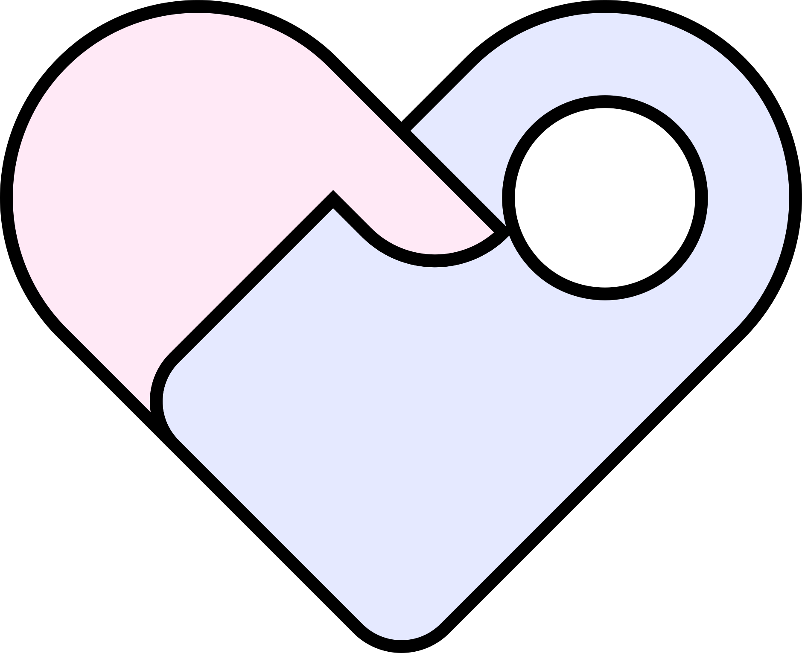
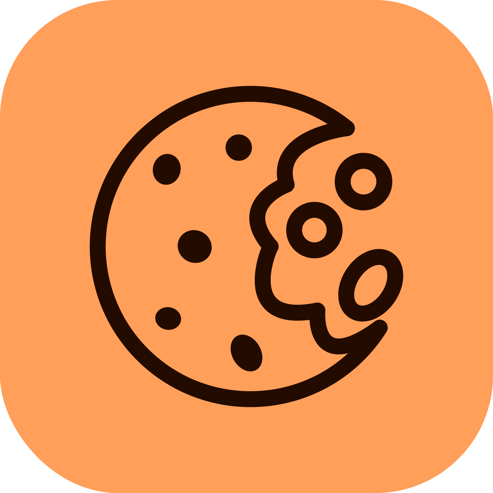

## I'm Front-end developer

### Languages and Tools

### Favorite IDE's

### Works

 
 <samp>⌛ Опыт работы</samp>

 
|     =)              |          Место работы                                |         Должность/Стек             |         Время                   |
| ----------------- | ---------------------------------------- | ------------------ | ---------------------------- |
|    | [TagMate](https://tagmate.ru) | Founder & Front-end Lead  NextJS   | 06.2024 -  Настоящее время      |

 
 <samp>💼 Работы</samp>

|     =)              |          Проект                           |         Стек             |
| ----------------- | ---------------------------------------- | ------------------ |
|    | [TagMate](https://tagmate.ru) | Front-end NextJS   Back-end Express.js   |
|    | [Japan Kitchen](https://japan-kitchen.vercel.app/) | Front-end ReactJS   Back-end Firebase   |
|    | [Cookie Store](https://open-shop-seven.vercel.app) | Front-end ReactJS   Back-end Firebase   |
|    | [My Portfolio](https://ivan-wake.vercel.app) | Front-end NextJS   |

### Follow me

